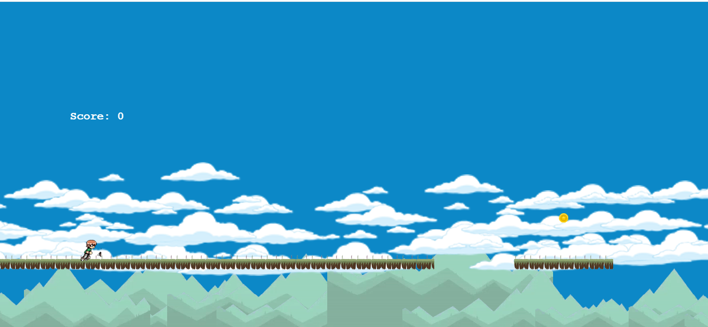
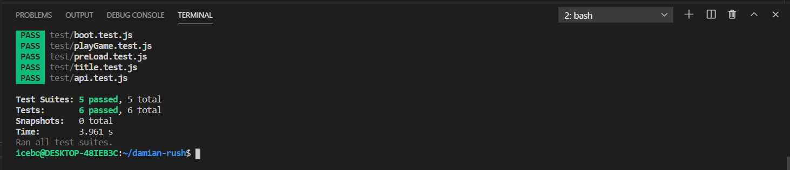

# damian-rush

This is a 2D game built with Phaser which is a JavaScript framwork for video game.

## Live Demo

[PLAY!](https://jolly-jang-ba35f9.netlify.app)



## Game instructions

- left click to jump.
- Double click to jump twice.
- Clikc on restart to restart the session.

## Usage

- Clone the repo  ```git clone https://github.com/icebox827/damian-rush.git```.
- cd into the game directory.
- Run  ```npm install```.
- Open in a browser.
- Enter your name.
- Click start to begin the game.

## Tests

Inside the game directory:

- Run  ```npm install``` to install project dependencies.
- Run ```npm run test``` to run the unit tests locally.



## Technologies

- HTML5
- CSS3
- Jest
- JavaScript
- CSS
- Linters
- Webpack
- Phaser 3
- Leaderboard API
- npm
- VSCode

## Author

👤 **Denis Lafontant**

- GitHub: [@icebox827](https://github.com/icebox827)
- Twitter: [@heracles2k5](https://twitter.com/@heracles2k5)
- LinkedIn: [LinkedIn](https://www.linkedin.com/in/denis-lafontant/)

## Design Process

The goal is to create a platform game where the main character is running, avoiding holes between platforms, collecting coins, avoiding fire endlessly.

### Story and gameplay

At first, the main idea was to create a game like Space Invader or Galaxy Defender and then came to my mind Temple Run, finally Super Mario Bros, one of my favorite childhood games.
So I decided to build a game mixing both Temple Run and Super Mario Bros idea, where the main character i.e the hero is running endlessly, avoiding holes, fire, and collecting coins.
I named the game Damian-Rush after the name of my son Damian as his birthday gift.

### Asset choices

I picked the assets by googling, and these include the player sprite, the coin, the fire, the platforms, the clouds, the background music, and the background.

### Before starting

I spent almost a day learning Phaser on Codecademy, and various Youtube videos. The official documentation is a great resource.

### Development stage
<!--Begin -->

> I started bynsetting up the environment, gathering assets, and make sure that Phaser is configured without problem.

> I created the different scenes for my game following the documentation, and my main objective was to create a basic phaser game with few functionnalities, which I did. This gives me some level of confidence because, from that point, I already have a deliverable.

> After that, I picked the scenes one after another, and I preloaded the required assets. I also link the scenes all together according to the game design, so I can move freely from one scene to another.

> Next, I added logic to animate player, the coin, and the fire. Having done these, I used object pool to add and remove platforms to the scene, and I add the bacground music.

> I later added logic to monitor collision between the player, the coin, the platform, and the fire. Lastly in the game scene, I added the scoring mechanism to keep track of the scores.

> A player does have to enter his name before playing the game. If a player did not enter his/her name, a warnong message will be displayed.

<!-- End -->

## 🤝 Contributing

Contributions, issues, and feature requests are welcome!

Feel free to check the [issues page](https://github.com/icebox827/damian-rush/issues/2).

## Show your support

Give a ⭐️ if you like this project!

### Acknowledgements

- Microverse
- Notion
- Phaser
- Leaderboard API
- Pexel
- Google

## 📝 License

This project is [MIT](LICENSE) licensed.
